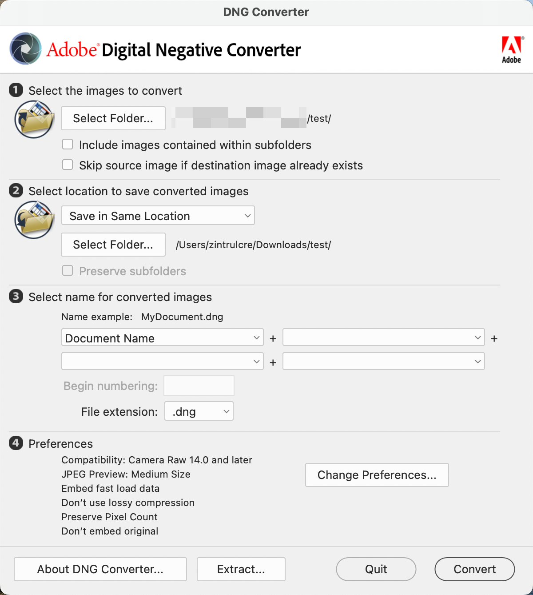
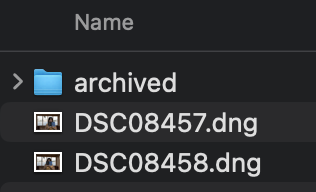

# Fujifilm Converter

This program allows you to use Fujifilm film simulation for any camera raw file by modifying the EXIF information.

## Comparision

- Sony PT Creative Style


- Fujifilm NC Film Simulation


## Instructions

1. Download and install the following tools:
  - [Adobe DNG Converter](https://helpx.adobe.com/camera-raw/using/adobe-dng-converter.html): Convert raw files taken by your camera to DNG files
  - [ExifTool by Phil Harvey](https://exiftool.org/): Convert DNG files to raw files containing Fuji camera EXIF information

2. Open Adobe DNG Converter, select the directory where your raw files are located, and click convert to start the conversion.



Once completed, you will see the following:


3. Run `python3 main.py` in the terminal, then enter the directory where the converted DNG files are located. The output will be as follows:

```sh
➜  exif-convert python3 main.py 
Please input the file: ./test
exiftool -make="FUJIFILM" -model="GFX100S" -uniquecameramodel="Fujifilm GFX 100S" ./test
    1 directories scanned
   32 image files updated
```

DNG files with the suffix `.dng_original` will be created in the directory you specified.



4. Drag these files into Lightroom, and you will be able to select all 19 Fuji film emulations.


