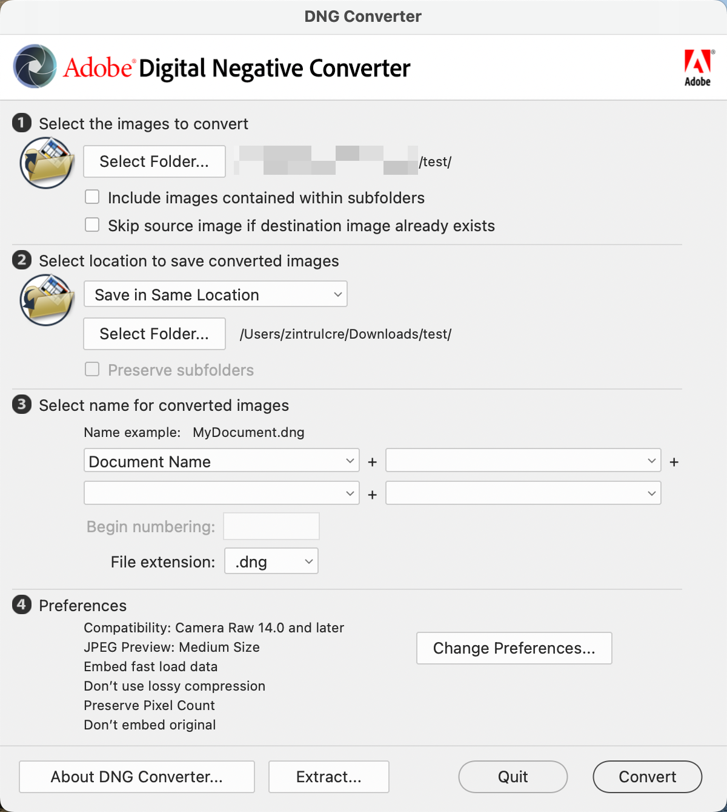
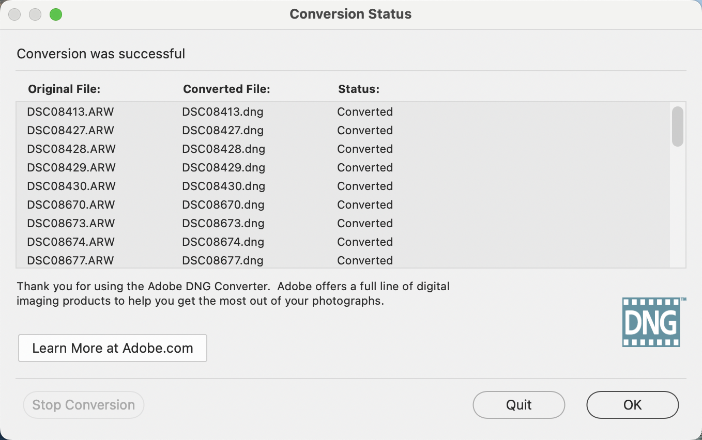
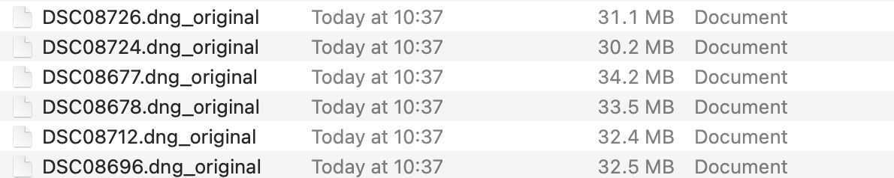
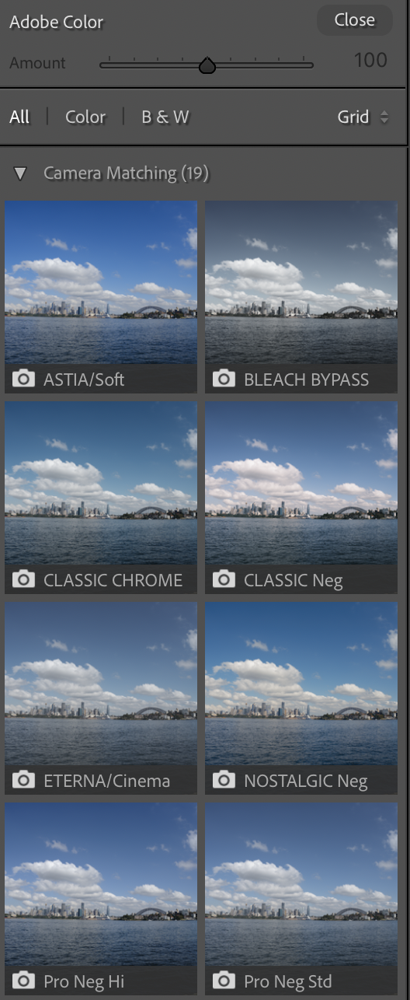

[English Version](./README-EN.md)

# Fujifilm Converter

这个程序可以把任意相机拍出来的 raw 格式照片通过修改 exif 信息的方式模拟成富士相机拍的, 从而在 lightroom 里面选出富士的胶片模拟

## 效果对比

- 索尼 PT 创意外观


- 富士 NC 胶片模拟


## 使用方法

1. 下载和安装以下工具
  - [Adobe DNG Converter](https://helpx.adobe.com/camera-raw/using/adobe-dng-converter.html): 用来将相机拍摄的 raw 文件转换成 dng 文件
  - [ExifTool by Phil Harvey](https://exiftool.org/): 用来将 dng 文件转换成包含富士相机 exif 信息的文件

2. 打开 Adobe DNG Converter, 选择你的 raw 文件所在的目录, 点击 convert 开始转换



完成之后可以看到如下界面



3. 在 terminal 里面运行 `python3 main.py`, 然后输入刚才转换好的 dng 文件所在的目录, 输出如下

```sh
➜  python3 main.py 
Please input the file: ./test
exiftool -make="FUJIFILM" -model="GFX100S" -uniquecameramodel="Fujifilm GFX 100S" ./test
    1 directories scanned
   32 image files updated
```

在刚才的目录里会得到一些新的 dng 文件, 原始文件被放进了 archived 目录



4. 把这些新的文件拖进 lightroom, 就可以选出富士所有的 20 种胶片模拟了


