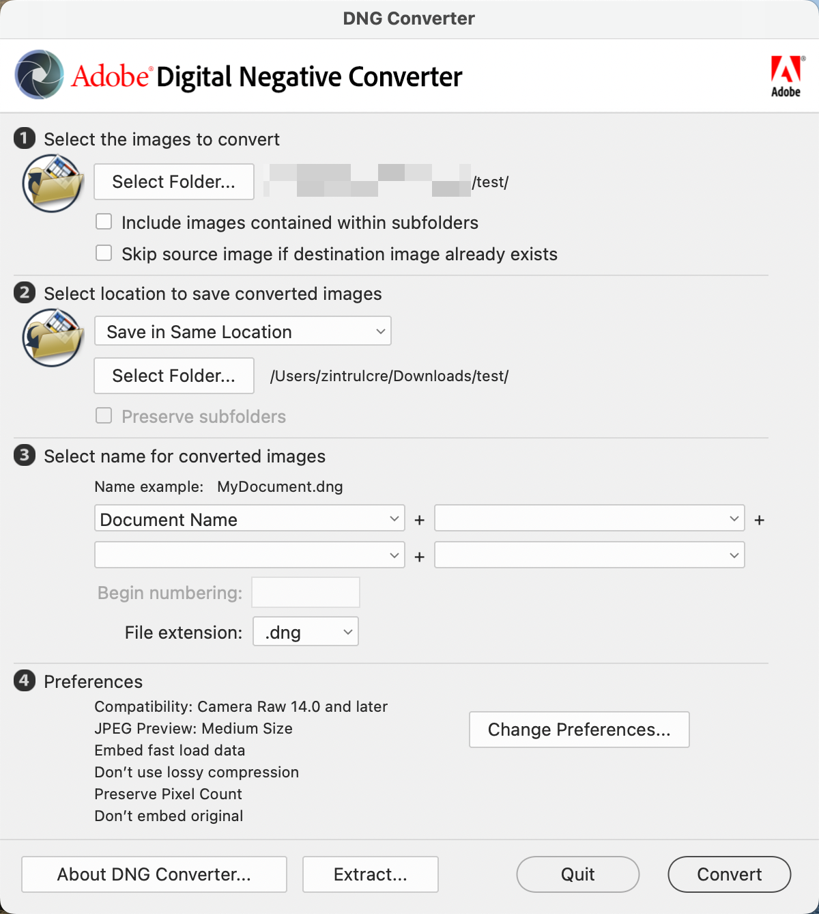
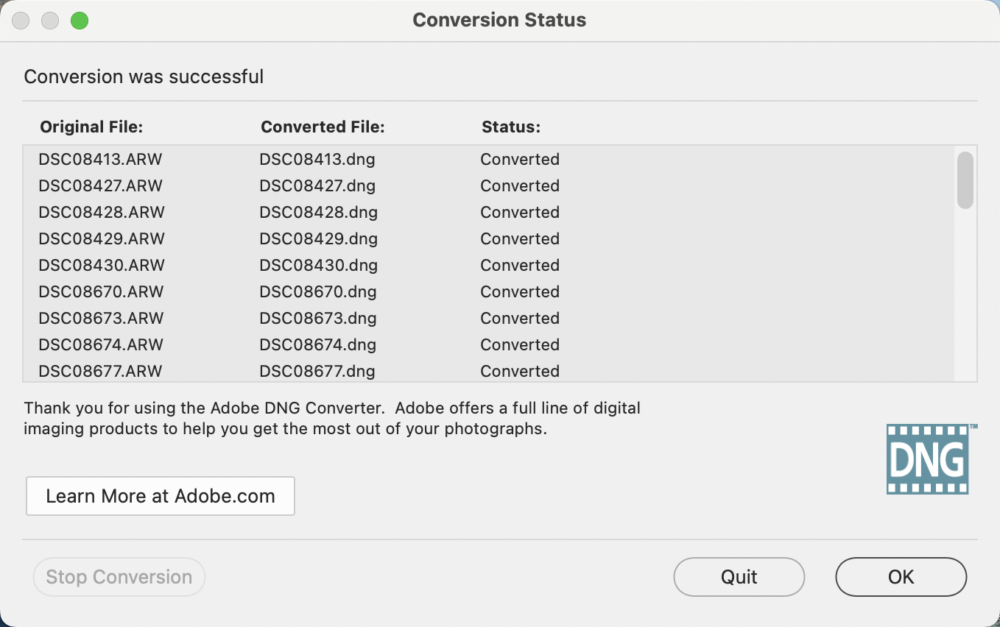
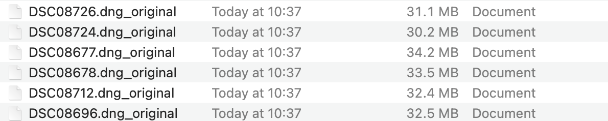
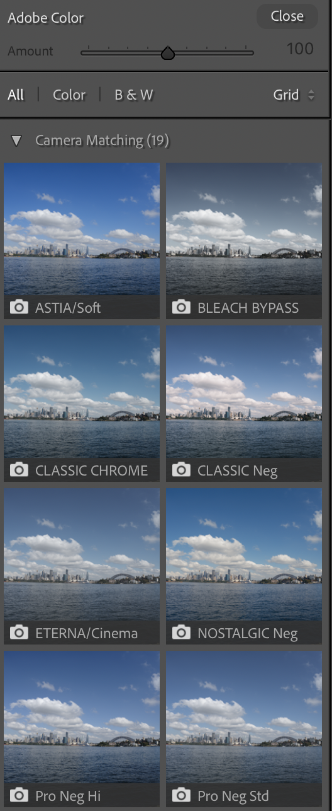

[English Version](./README-EN.md)

# Fujifilm Converter

这个程序可以把任意相机拍出来的 raw 格式照片通过修改 exif 信息的方式模拟成富士相机拍的, 从而在 lightroom 里面选出富士的胶片模拟

## 使用方法

### 一键自动化（推荐）

安装本工具：
```sh
pipx install -e .
```

直接运行（默认富士预设，一条命令完成全部流程）：
```sh
fuji-convert ./photos/
fuji-convert --check
```

dnglab 会自动下载（如果系统没有）。ExifTool 仍需手动安装（推荐 `brew install exiftool` 或用 Docker 完全免安装）。

处理完成后得到修改过 EXIF 的 `.dng` 文件，原始 RAW 移到 `originals/`。

输入已是 DNG 时加 `--skip-convert`。

### 手动分步（旧流程）

1. 下载和安装以下工具
  - [Adobe DNG Converter](https://helpx.adobe.com/camera-raw/using/adobe-dng-converter.html): 用来将相机拍摄的 raw 文件转换成 dng 文件
  - [ExifTool by Phil Harvey](https://exiftool.org/): 用来将 dng 文件转换成包含富士相机 exif 信息的文件

2. 打开 Adobe DNG Converter, 选择你的 raw 文件所在的目录, 点击 convert 开始转换



完成之后可以看到如下界面



3. 在 terminal 里面运行 `python3 fuji.py`, 然后输入刚才转换好的 dng 文件所在的目录, 输出如下

```sh
➜  python3 fuji.py
Please input the dir: ./test
exiftool -make="FUJIFILM" -model="GFX100II" -uniquecameramodel="Fujifilm GFX 100 II" ./test
    1 directories scanned
   32 image files updated
```

在刚才的目录里会得到一些新的 dng 文件, 原始文件被放进了 originals 目录



4. 把这些新的文件拖进 lightroom, 就可以选出富士所有的 20 种胶片模拟了



## 快速开始

**Docker 方式（零依赖）**

```sh
# 构建一次
docker build -t fujifilm-converter .

# 运行
docker run --rm -v "$(pwd)":/data -w /data fujifilm-converter ./photos/
```

**本地方式**

安装后直接运行
```sh
fuji-convert ./photos/
```

支持预设（默认 fuji）:
```sh
fuji-convert --preset hasselblad ./photos/
fuji-convert --preset leica ./photos/
```

使用 Agent 时，直接把这个仓库的链接发给 Agent，它就可以执行转换。

## 效果对比

- 索尼 PT 创意外观


- 富士 NC 胶片模拟


